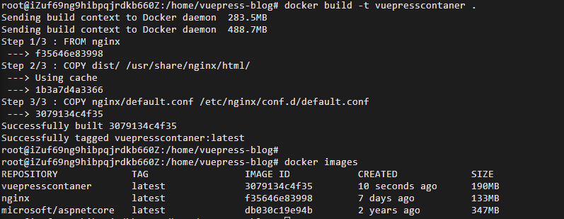

# 【运维】手把手教你docker部署vuepress项目
1. 前言
Docker 作为轻量级虚拟化技术，拥有持续集成、版本控制、可移植性、隔离性和安全性等优势。本文使用Docker来部署一个vuepress项目，并尽可能详尽的介绍了实现思路和具体步骤，以方便有类似需要的同学参考。
> Docker 是一个开源的应用容器引擎，基于 Go 语言 并遵从 Apache2.0 协议开源。

> Docker 可以让开发者打包他们的应用以及依赖包到一个轻量级、可移植的容器中，然后发布到任何流行的 Linux 机器上，也可以实现虚拟化。

> 容器是完全使用沙箱机制，相互之间不会有任何接口（类似 iPhone 的 app）,更重要的是容器性能开销极低。

> Docker的应用场景
>> 1. Web 应用的自动化打包和发布。
>> 2. 自动化测试和持续集成、发布。
>> 3. 在服务型环境中部署和调整数据库或其他的后台应用。
>> 4. 从头编译或者扩展现有的 OpenShift 或 Cloud Foundry 平台来搭建自己的 PaaS 环境。

> Docker 的优点
>>Docker 是一个用于开发，交付和运行应用程序的开放平台。Docker 使您能够将应用程序与基础架构分开，从而可以快速交付软件。借助 Docker，您可以与管理应用程序相同的方式来管理基础架构。通过利用 Docker 的方法来快速交付，测试和部署代码，您可以大大减少编写代码和在生产环境中运行代码之间的延迟。

>> 1、快速，一致地交付您的应用程序
>>>Docker 允许开发人员使用您提供的应用程序或服务的本地容器在标准化环境中工作，从而简化了开发的生命周期。

>>>容器非常适合持续集成和持续交付（CI / CD）工作流程，请考虑以下示例方案：

>>>您的开发人员在本地编写代码，并使用 Docker 容器与同事共享他们的工作。
>>>他们使用 Docker 将其应用程序推送到测试环境中，并执行自动或手动测试。
>>>当开发人员发现错误时，他们可以在开发环境中对其进行修复，然后将其重新部署到测试环境中，以进行测试和验证。
>>>测试完成后，将修补程序推送给生产环境，就像将更新的镜像推送到生产环境一样简单。
>>2、响应式部署和扩展
>>>Docker 是基于容器的平台，允许高度可移植的工作负载。Docker 容器可以在开发人员的本机上，数据中心的物理或虚拟机上，云服务上或混合环境中运行。

>>>Docker 的可移植性和轻量级的特性，还可以使您轻松地完成动态管理的工作负担，并根据业务需求指示，实时扩展或拆除应用程序和服务。

>>3、在同一硬件上运行更多工作负载
>>>Docker 轻巧快速。它为基于虚拟机管理程序的虚拟机提供了可行、经济、高效的替代方案，因此您可以利用更多的计算能力来实现业务目标。Docker 非常适合于高密度环境以及中小型部署，而您可以用更少的资源做更多的事情。

默认已经安装了 docker

相关版本：

Docker version 18.03.0-ce, build 0520e24302

运行环境为win+linux，如果与阅读者操作系统之间存在差异，请自行调整

相关镜像：

nginx:latest
node:latest

2.具体实现：
创建一个vuepress项目，基于nginx docker镜像构建成一个前端工程镜像，然后基于这个前端工程镜像，启动一个容器 vuepresscontainer。


## 问题
### no such file or directory
问题如下
```
COPY failed: stat /var/lib/docker/tmp/docker-builder698191588/nginx/default.conf: no such file or directory
```

解决方案

`default.conf` 放置目录不对，先创建 `nginx`，将其放入其中，`Dockerfile` 中的 `COPY nginx/default.conf /etc/nginx/conf.d/default.conf`
会将 `nginx` 文件夹下的 `default.conf` 替换到 `/etc/nginx/conf.d/` 文件夹下。




### 使用docker 出现Error response from daemon: Conflict. The container name
“***” is already in use
解决方法：
（1）给容器换一个名字, 比如说 docker run -it --name=mycentos2 centos:7 /bin/bash, 可以解决问题.
（2）将原来的容器删除

查询当前容器：docker container ls -all
在这里插入图片描述
删除当前容器：docker container rm mycentos(提示: 这一步要确定删除容器没问题的情况下, 才可以做)

### docker删除镜像Error response from daemon: conflict: unable to remove repository reference
1. 停止container，这样才能够删除其中的images：

docker stop $(docker ps -a -q)

如果想要删除所有container的话再加一个指令：

docker rm $(docker ps -a -q)
狠心把容器都删除掉了，因为光停止还是不能删除镜像。

2. 查看当前有些什么images    docker images

3. 相关容器关闭后，删除对应的images，通过image的id来指定删除谁

docker rmi ID

 要删除全部image的话    docker rmi $(docker images -q)